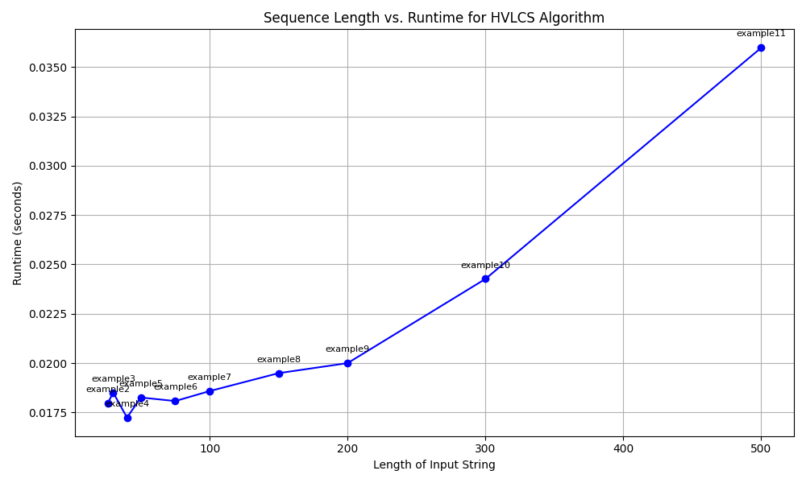
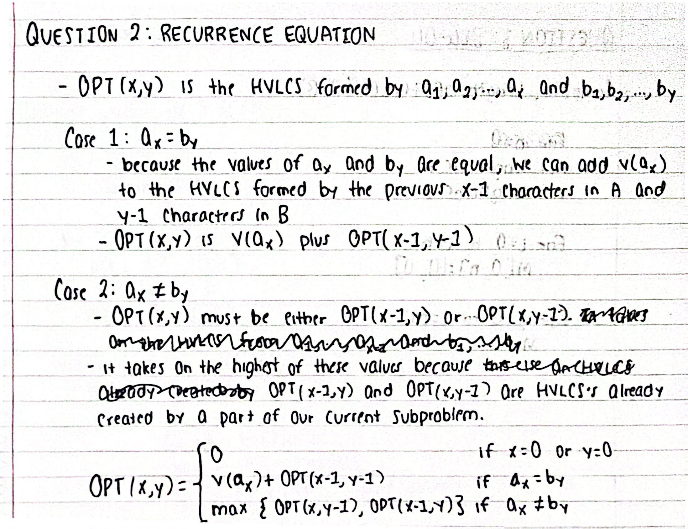
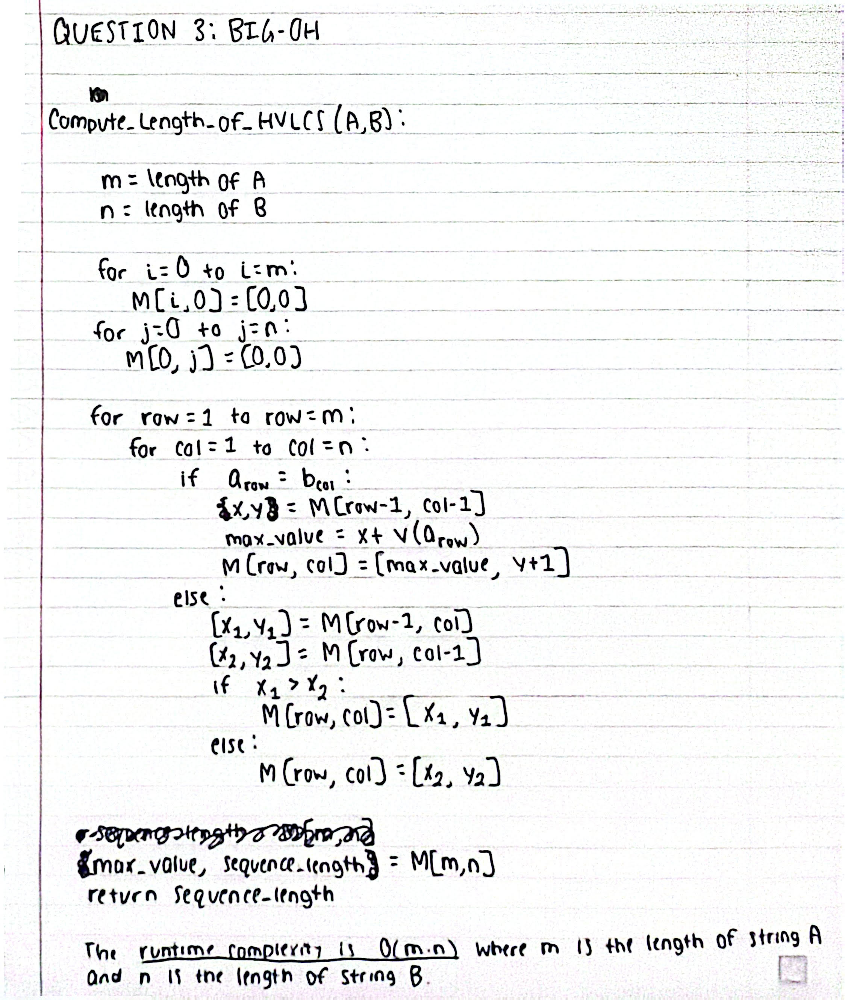

# Programming Assignment 3: Highest Value Longest Common Subsequence

## Authors
* **Name 1:** Vinay Reddy Ratnam (UFID: 20765170)
* **Name 2:** Isaac Philipose (UFID: 86084445)

---

## Instructions to Compile/Build
Since this project is implemented in **Python 3**, there is no explicit compilation step (like `make` or `javac`). However, the environment must be set up correctly to run the scripts.

* **Prerequisites:** Python 3.6 or higher.
* **Dependencies:**
    * The read and write files (input_parser.py and output_writer.py) use only standard libraries (`sys`).

---

## Instructions to Run
The programs are designed to communicate via **Standard Input/Output (stdin/stdout)**. This allows for flexible testing and piping through main.py.

* **Basic Run (Output to Terminal):**
  ```bash
  python3 src/main.py < [Location of Input File]
  ```

* **Save Output to File:**
  ```bash
  python3 src/main.py < [Location of Input File] > [Name of Output File]
  ```

* **Example:**
  ```bash
  python3 src/main.py < data/input/example1.in > data/output/output1.out
  ```

---

## Assumptions
* **Input/Output Format:** The program expects inputs from Standard Input (`stdin`) with the proper layout: `K` (alphabet size), followed by `K` lines of `character value`, followed by String `A` and String `B`. It outputs the highest value and the corresponding subsequence string to Standard Output (`stdout`).
**Example Input**:

3
a 2
b 4
c 5
aacb
caab

**Example Output**
9
cb

* **Dependencies:** The main algorithm runs entirely on Python Standard Library (`sys`). External libraries (like `matplotlib`) are only required for the optional runtime graph generation script (`graph_runtime.py`).



